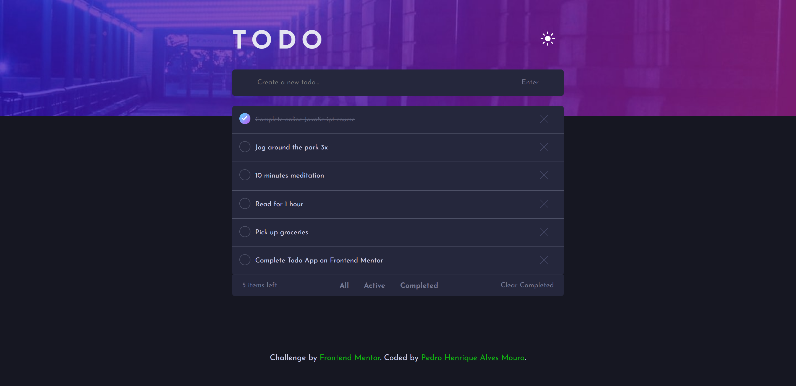
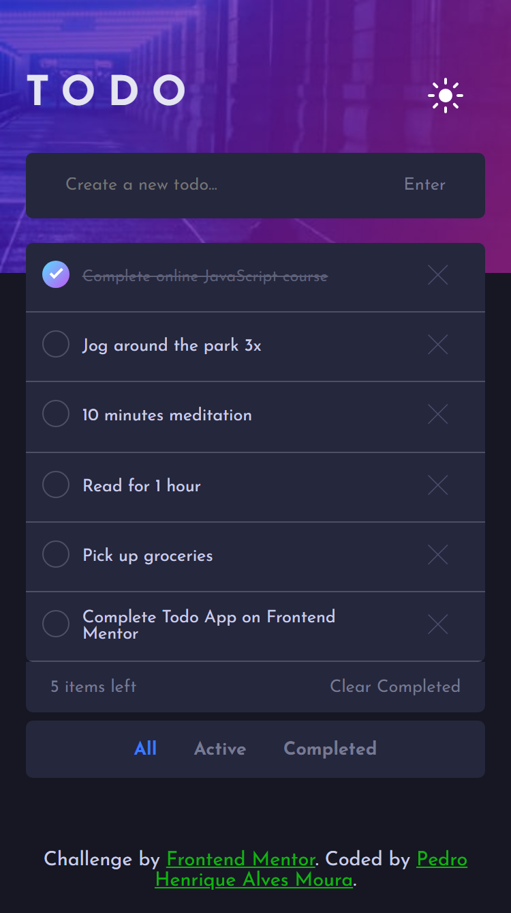

# Frontend Mentor - Todo app solution

<!--  -->
This is a solution to the <a href="https://www.frontendmentor.io/challenges/todo-app-Su1_KokOW" alt="Todo app
" target="_blank">Todo app Challenge</a>  

*Frontend Mentor challenges help you improve your coding skills by building realistic projects.*

## Table of contents

- [Overview](#overview)
  - [The challenge](#the-challenge)
  - [Screenshots](#screenshots)
  - [Links](#links)
- [My process](#my-process)
  - [Built with](#built-with)
  - [What I learned](#what-i-learned)
  - [Continued development](#continued-development)
  - [Useful resources](#useful-resources)
- [Author](#author)

## Overview

### The challenge

Users should be able to:

- (V) See hover states for all interactive elements on the page
- (V) Add new todos to the list
- (V) Mark todos as complete
- (V) Delete todos from the list
- (V) Filter by all/active/complete todos
- (V) Clear all completed todos
- (V) Toggle light and dark mode

### Screenshots

  *OBS: THE IMAGES MAY NOT BE IN THE SAME SCALE.*

# MODEL - Frontend Mentor -  Todo app preview

  

  

# MY SOLUTION - Frontend Mentor -  Todo app solution

  

  

### Links

<!-- - Live Site URL: [https://pedro-todo-vuejs-app.netlify.app](Vue - Todo App) -->
- Live Site: <a href="https://pedro-vuejs-todo-app.netlify.app" alt="Todo app" target="_blank">Todo app Challenge</a>

## My process

### Built with

- Semantic HTML5 markup
- CSS custom properties
- Flexbox
- CSS Grid
- CSS Animations
- - CSS Transitions
- - CSS Transform
- SASS
- Mobile-first workflow
- Vue.JS
- Vue.js Transitions
- VueX

### What I learned

This challenge was a great opportunity to test my CSS, JS and Vue.JS skills. I need to do some research to learn a little more about how Vue handles transitions, how to work correctly with 'created' and 'watch' methods, theme switcher, arrow functions, and how to set elements in local storage.

### Continued development

To my next project I want to test my JS skills by using an API.

### Useful resources

- <a href="https://vuejs.org/v2/guide/transitions.html" alt="Enter/Leave & List Transitions" target="_blank">Enter/Leave & List Transitions</a>
- <a href="https://www.youtube.com/watch?v=nOd8yVfu3N4" alt="Transitioning Between Elements" target="_blank">Transitioning Between Elements</a>
- <a href="https://animate.style" alt="CSS Transitions" target="_blank">CSS Transitions</a>
- <a href="https://stackoverflow.com/questions/5915023/preventing-images-and-text-to-be-selected/5915056" alt="Animate.css" target="_blank">Animate.css</a>

## Author

- Frontend Mentor - [@Pedrohamoura-Git](https://www.frontendmentor.io/profile/Pedrohamoura-Git)
- Instagram - [@ph_pedrohenrique21](https://www.instagram.com/ph_pedrohenrique21/)
